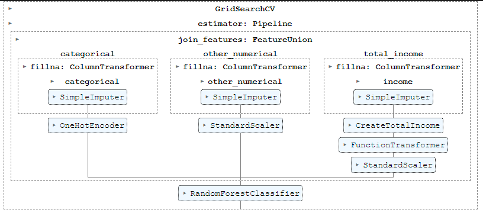
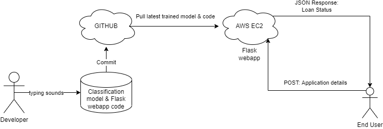
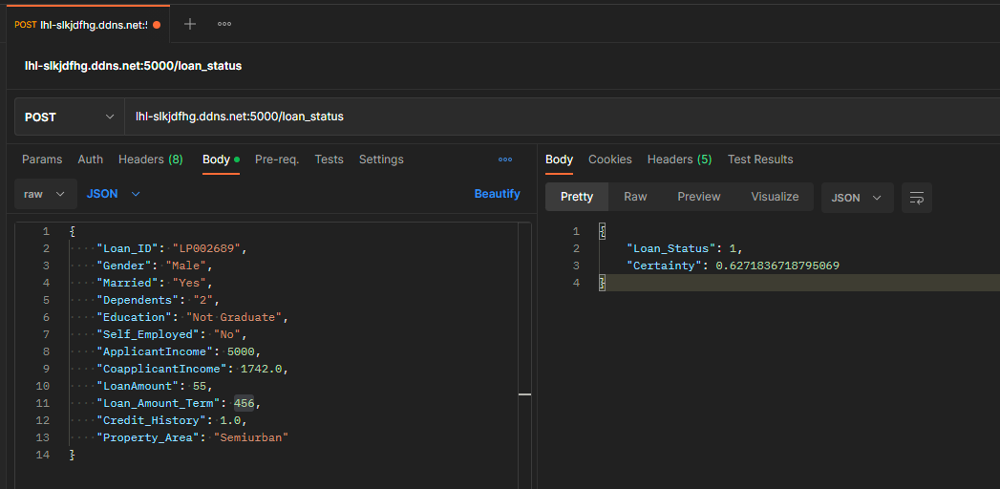

# Mini-project IV

### [Assignment](assignment.md)
Author: Mynhardt Burger

## Project/Goals
The goals are to:
1. Build a classification machine learning model to predict the Loan_Status of applicants given their details
2. Deploy the model to AWS so that it can be interacted with via an API endpoint

## Hypothesis
Several factors will be indicative of the candidate risk and hence the success of their loan application. They are described below:
* A credit history proves a track record
* The property location type (area) can be used to infer certain environmental risks, and the ability to ultimately recover the capital via sale
* Loan amounts too large increases risk and reduces acceptance likelyhood
* Loan term not align with the bank's strategy
* Total income and number of dependends speaks to the ability to meet subsistence needs
* Education and Self employed speaks to employability and stability of income stream

Gender and marital status was specifically excluded to avoid potential discrimination

## EDA 
* Missing values:
    * dataset is fairly complete
    * the median Loan_Amount is varies significantly relative to: Education, Self_Employed and Dependents
* Distribution:
    * Numerical values are all fairly skewed, but roughly normally distributed.
    * Target (Loan_Status) is moderatly unbalanced with approx 2x as many approvals as refusals

## Process
### EDA
The following techinques were used to understand the data:
1. Shape of dataset
2. Field types determined
3. Identify missing values in columns
4. Categorize fields: Categorical vs Numerical
    * Categorical: Value counts
    * Numerical: Distribution
    * Combined:
        * Descriptive statistics & box plots by major category
5. Target value counts
### Cleaning
Categorical values imputed using the **mode** for each field.  
Numerical missing values were imputed using the **median** becuase of the skewness of their distributions

### Feature engineering
* TotalIncome was calculated as ApplicantIncome + CoapplicantIncome
* TotalIncome had high positive skewness, hence it was log transformed to achieve a more normal distribution
* TotalIncome, LoanAmount, Loan_Amount_Term were all mean centered and standard deviation scaled
* Education, Self_Employed, Dependents, Credit_History and Property_Area were one hot encoded

### Modeling
1. Train(70%) / test(30%) datasets were created
2. Pipelines setup to apply all cleaning, feature engineering and modeling steps
3. 7 classification models were evaluated via gridsearch with cross validation using the ROC_AUC scoring metric
    * KNearestNeighbours
    * SupportVectorClassifier: Linear and Radial Basis Function (RBF)
    * Gaussian Naive Bayes
    * Random Forest
    * AdaBoost
    * Gaussian process classification

Due to time constraints no hyper parameter tuning was performed.

### Deployment
The trained model was saved using joblib. A Flask web app created to expose an API endpoint through which new loan_status predictions can be retrieved by submitting a POST request with the data in JSON format in the body of the request. The project is commited to GIT and cloned to the AWS EC2 instance to ensure easy deployment for code updates and retrained models. The Flask server currently runs within a detached tmux session inside a python virtual environment.  

## Results/Demo
The Random Forest classifier provided the best ROC_AUC score on the test data of 0.7845 using all default paramaters except of max_depth=5.

The API can be accessed at: http://lhl-slkjdfhg.ddns.net:5000/loan_status

## Challanges 
1. Writing user defined transformers to better control the transformations was a partial success.
2. AWS EC2 instance keeps on crashing when I install python packages, corrupting the install.

## Future Goals
1. Implement more accurate custom transformers
2. Perform hyper parameter tuning
3. Make the model pipeline and Flask API more resilient to missing values in the JSON payload. Currently it understands NaN (due to the SimpleImputer for missing values), but blank fields, empty strings and missing fields causes errors.
4. Setup auto start scripts for the Flask API server
5. Formalize it as Infrastructure As Code (IAC) using terraform with CI/CD using GIT Actions